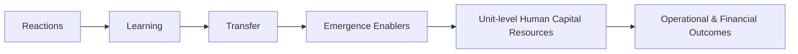

# PM Effectiveness Value Chains

The core contribution of [[schleicher-2019-pm-effectiveness-review|Schleicher et al. (2019)]]: a **comprehensive, multilevel model of the evaluative criteria** for performance management, and the mediational paths ("value chains") that link PM practices to organizational value.

## The criterion chain

Each stage is tracked at **both** the **employee/ratee** and **manager/rater** level — a key innovation, since the manager side has been almost entirely ignored.

- **Reactions** — affective, cognitive, utility, satisfaction. How employees/managers feel/think about PM.
- **Learning** — cognitive, skills-based, attitudinal/motivational (Kraiger, Ford & Salas 1993). **Rating quality/accuracy is reclassified here** as a product of *manager* learning, not the endpoint.
- **Transfer** — effects carrying back to the job: employee performance/attitudes; manager relational quality, decision quality, general effectiveness.
- **Emergence enablers** — climate, culture, leadership, trust in management, org learning, team cohesion, quality of human-capital decisions. Moderate whether individual gains aggregate upward.
- **Unit HCRs** — skills/abilities/potential + motivational capabilities (AMO framework; Ployhart & Moliterno 2011).
- **Operational** (productivity, quality, safety, turnover) and **financial** (ROI, sales/firm growth) outcomes.

## What the field actually studied
Coding 488 empirical articles (1984–2018): the literature clusters on **proximal** criteria (reactions, rating quality) and rarely touches the distal unit/firm links or manager-side criteria. The "black box" between PM and firm performance is essentially untested — the modern face of the [[Criterion Problem]].

## Three pressing questions (16 propositions)
1. **How do individual outcomes emerge into unit outcomes?** Via ability- *and* motivation-based HCRs; emergence enablers moderate (Props 1–5).
2. **How essential are positive reactions?** They predict learning/transfer but are likely **not necessary conditions** (Props 6–12). Feeling good about PM isn't the goal.
3. **What is the value of a performance rating?** Possibly in **what managers learn by rating** and the quality of human-capital decisions it enables (Props 13–16). Dropping ratings may strengthen the manager-learning→outcome link but lower decision quality.

## See also
- [[Performance Management]] · [[Criterion Problem]] · [[Three Assumptions of Performance Rating]]
- [[Performance Management MOC]]
