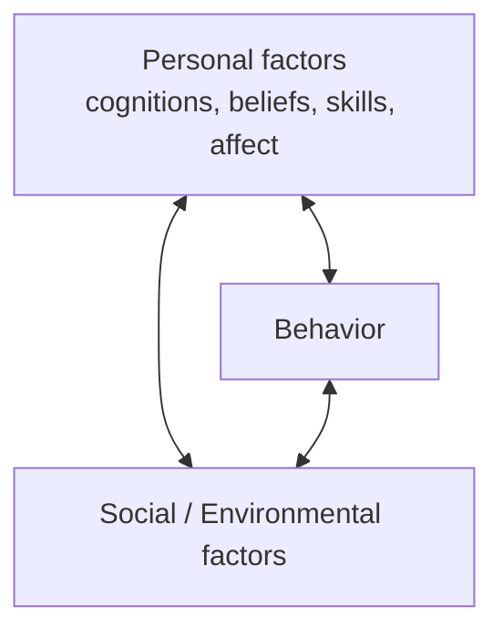

# Triadic Reciprocal Causation

Nav: [[index]] | [[Social Cognitive Theory]]

The central causal architecture of **[[Social Cognitive Theory]]**: human functioning arises from **reciprocal interactions among three sets of influences** that operate as interacting, bidirectional determinants — none is primary.

- **Person ↔ Behavior**: self-efficacy influences task choice, effort, persistence (P→B); observing one's own progress raises efficacy (B→P).
- **Person ↔ Environment**: a teacher's beliefs about a student shape reactions (P→E); "I know you can do this" feedback shapes efficacy (E→P).
- **Behavior ↔ Environment**: a teacher's cue directs behavior (E→B); a wrong answer prompts reteaching (B→E).

The three influences are **codeterminants**, not a causal chain across levels. Sociostructural factors (SES, family, economy) act **through** psychological mechanisms of the self-system (aspirations, efficacy, standards, affect) rather than directly.

## Environment types

Bandura distinguishes three gradations of environment by changeability: **imposed**, **selected**, and **constructed** — each demanding different scope of personal agency.

Sources: [[bandura-2001-social-cognitive-theory-agentic|Bandura (2001)]]; elaborated in [[schunk-usher-2012-social-cognitive-theory-motivation|Schunk & Usher (2012)]].
